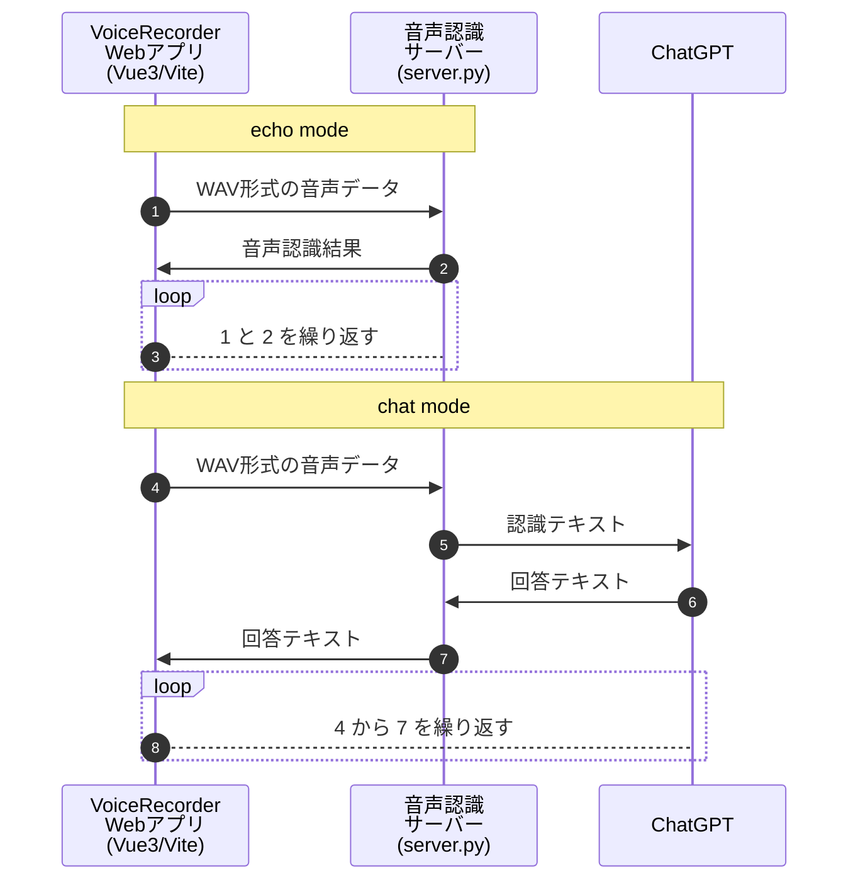

# voice-recorder

Vue3(Vite/Typescript)で作成したReazonSpeechを使用した音声認識アプリです。
startボタンを押下すると音声認識開始します。

左上の Mode を Echoにすると、オウム返し、Chat にすると、ChatGPTと会話できます。


## システム構成/シーケンス図

Webアプリと音声認識サーバーの２つで構成されています。
Webアプリはフレームワークに[Vue3/Vite](https://ja.vuejs.org/)を使用しています。言語はTypescriptです。
音声認識サーバーはPythonで作られており、認識エンジンとして[ReazonSpeech](https://research.reazon.jp/projects/ReazonSpeech/index.html)を使用しています。音声認識サーバーの認識エンジンは OpenAI の [Whisper](https://openai.com/research/whisper) に変更することもできます。



## ステート図

音声認識の処理はサーバー側で処理されます。音声認識処理中も録音は停止しませんが、発話中は停止されます。


## プロジェクトのセットアップ

ReazonSpeechを実行するにはPythonのバージョン要件に従う必要があります。
開発で使用したPythonのバージョンは 3.9.13 です。

```sh
$ python --version
Python 3.9.13
```

音声認識で使用するデータセットにアクセスするには [HuggingFace](https://huggingface.co/) のアカウント作成と [huggingface-cli](https://huggingface.co/docs/huggingface_hub/quick-start) login で認証する必要があります。

下記リンクの「ReazonSpeech HowToガイド」を参照してください。

- [ReazonSpeech](https://research.reazon.jp/projects/ReazonSpeech/index.html)
- [ReazonSpeechクイックスタート](https://research.reazon.jp/projects/ReazonSpeech/quickstart.html)
- [ReazonSpeech HowToガイド](https://research.reazon.jp/projects/ReazonSpeech/howto.html)
- [ReazonSpeech APIリファレンス](https://research.reazon.jp/projects/ReazonSpeech/api.html)

Webアプリケーションは Vue3(Vite/Typescript)で作成しています。
[Node.js](https://nodejs.org/ja) をインストールして以下のコマンドで必要なモジュールをダウンロードしてください。

```sh
$ npm install
または
$ yarn install
```

## ChatGPT の環境変数

Chatモードを機能させるには以下の環境変数に値を設定します。

- OPENAI_ORGANIZATION_ID
- OPENAI_API_KEY

プロジェクトのルートに .env.local ファイルを作成して環境変数を記入すると自動的に読み込んで設定されます。

```env
OPENAI_ORGANIZATION_ID=XXXXXXXXXXXXXXXXXXXX
OPENAI_API_KEY=XXXXXXXXXXXXXXXXX
```

環境変数の設定がない場合は語尾に「ですね」をつけて返します。

会話データは ./work/history.csv ファイルに記録されます。また ./work/history.csv は対話データのキャッシュとして利用され、過去に同様の対話があった場合は ChatGPT へのリクエストは行いません。

## 実行方法

音声データ(Wav)を受診してReazonSpeechで認識するためのサーバーを起動します。
初回実行は840Mバイト程度のデータをダウンロードしますのでしばらく時間がかかります。

データセットを huggingface からダウンロードするにはアクセストークンが必要です。サーバーの起動の前に huggingface-cli login して実行してください。

```bash
# 音声認識サーバーの起動
$ ./script/start-server.sh
```

Vue3アプリを起動します。

```sh
$ npm run dev
または
$ yarn dev
VITE v4.4.2  ready in 319 ms

➜  Local:   http://localhost:5173/
➜  Network: use --host to expose
➜  press h to show help
```

表示されたURLをブラウザで開きます。

## VoiceRecorderクラス

VoiceRecorderクラスは音声認識を管理しています。認識するには server.py が稼働していなければいけません。

VoiceRecorderクラスについてはこちらの「[README.md](./src/audio/voice/README.md)」を参照してください。

## ReazonSpeechをローカル実行する方法

ReazonSpeechは初回起動時に学習モデルの情報をhuggingfaceのサーバーに取りに行こうとする。
実際にはすでにモデルデータがダウンロードされている場合はダウンロードされずキャッシュが採用されるが、初回起動のみGETリクエストが必要となり、インターネット接続が必要になる。

このインターネット接続を回避して完全にローカル実行するためには、espnet_model_zoo/downloader.py の以下の関数に「local_files_only=True」の1行加える必要がある。

```python
def huggingface_download(
    self, name: str = None, version: int = -1, quiet: bool = False, **kwargs: str
) -> str:
    # Get huggingface_id from table.csv
    if name is None:
        names = self.query(key="name", **kwargs)
        if len(names) == 0:
            message = "Not found models:"
            for key, value in kwargs.items():
                message += f" {key}={value}"
            raise RuntimeError(message)
        if version < 0:
            version = len(names) + version
        name = list(names)[version]

    if "@" in name:
        huggingface_id, revision = name.split("@", 1)
    else:
        huggingface_id = name
        revision = None

    return snapshot_download(
        huggingface_id,
        revision=revision,
        library_name="espnet",
        local_files_only=True,  # <=== この１行を加える
        cache_dir=self.cachedir,
    )
```

## docker-compose の実行

データセットをダウンロードするには HuggingFace のアクセストークンが必要です。[HuggingFace](https://huggingface.co/) にログインして、Settings から AccessToken を選択してアクセストークンを作成します。アクセストークンの取得方法は「[User access tokens](https://huggingface.co/docs/hub/security-tokens)」を参照してください。

```bash
# Hugging Face のアクセストークンを環境変数に設定
$ export HUGGINGFACE_TOKEN=XXXXXXXXXXXXXXXXX

# compose up
$ docker-compose up -d

# コンテナにログインしてサーバーを起動
$ docker-compose exec reazon-dev bash
$ ./scripts/start-server.sh

# 別のshellでコンテナにログインして yarn dev
$ docker-compose exec reazon-dev bash
$ yarn install
$ yarn dev
VITE v4.4.2  ready in 319 ms

➜  Local:   http://localhost:5173/
➜  Network: use --host to expose
➜  press h to show help
```

表示されたURLをブラウザで開きます。

イメージをビルドし直す場合は以下のスクリプトを実行してください。

```sh
# 再ビルドする場合
$ ./scripts/rebuld-up.sh
```

## VSCodeのセットアップ

VSCodeのVolarとTypeScript Vue Plugin (Volar)をインストールします。

[VSCode](https://code.visualstudio.com/) + [Volar](https://marketplace.visualstudio.com/items?itemName=Vue.volar) (and disable Vetur) + [TypeScript Vue Plugin (Volar)](https://marketplace.visualstudio.com/items?itemName=Vue.vscode-typescript-vue-plugin).

## Type Support for `.vue` Imports in TS

TypeScript cannot handle type information for `.vue` imports by default, so we replace the `tsc` CLI with `vue-tsc` for type checking. In editors, we need [TypeScript Vue Plugin (Volar)](https://marketplace.visualstudio.com/items?itemName=Vue.vscode-typescript-vue-plugin) to make the TypeScript language service aware of `.vue` types.

If the standalone TypeScript plugin doesn't feel fast enough to you, Volar has also implemented a [Take Over Mode](https://github.com/johnsoncodehk/volar/discussions/471#discussioncomment-1361669) that is more performant. You can enable it by the following steps:

1. Disable the built-in TypeScript Extension
    1) Run `Extensions: Show Built-in Extensions` from VSCode's command palette
    2) Find `TypeScript and JavaScript Language Features`, right click and select `Disable (Workspace)`
2. Reload the VSCode window by running `Developer: Reload Window` from the command palette.

## 設定のカスタマイズ

Viteの設定については下記リンクを参照

See [Vite Configuration Reference](https://vitejs.dev/config/).

## プロジェクトのセットアップ

```sh
npm install
```

### ホットリロードで開発する場合

```sh
npm run dev
```

### アプリをビルドする場合

```sh
npm run build
```

### [Vitest](https://vitest.dev/) を使用して単体テストを実行

```sh
npm run test:unit
```

### [Playwright](https://playwright.dev) を使用してE2Eテストを実行

```sh
# Install browsers for the first run
npx playwright install

# When testing on CI, must build the project first
npm run build

# Runs the end-to-end tests
npm run test:e2e
# Runs the tests only on Chromium
npm run test:e2e -- --project=chromium
# Runs the tests of a specific file
npm run test:e2e -- tests/example.spec.ts
# Runs the tests in debug mode
npm run test:e2e -- --debug
```

### [ESLint](https://eslint.org/) を使用して構文チェックを実行

```sh
npm run lint
```

## openai whisper で音声認識する

以下のスクリプトを実行して音声認識サーバーを起動します。初回起動時、mediumサイズのデータセット(1.4G)をダウンロードします。

```sh
# サンプルデータの音声認識
$ ./trans_whisper.py ./testdata/sample.wav
```

```sh
# 音声認識サーバーを whisper で起動
$ ./scripts/start-server-whisper.sh
```
